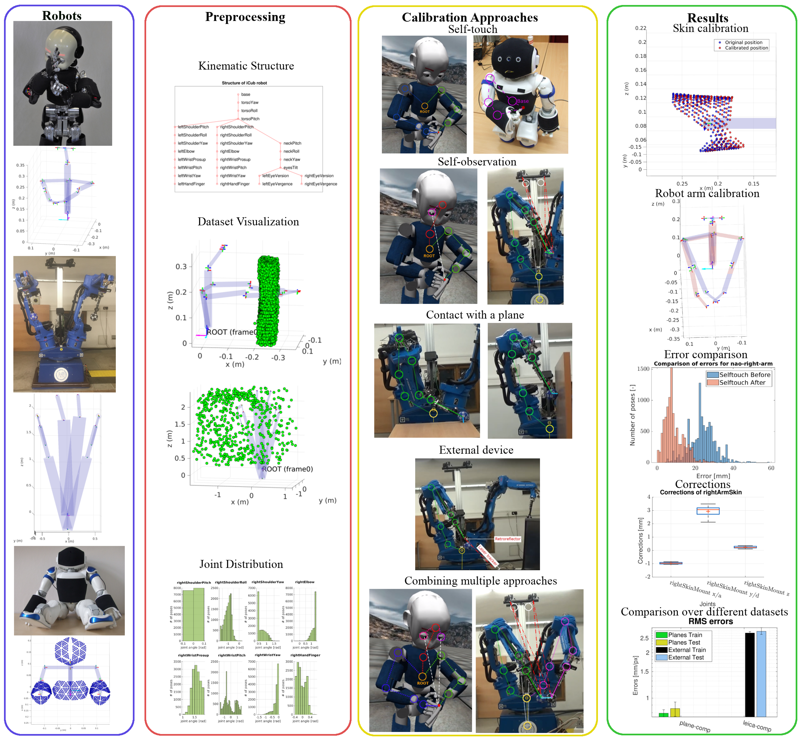

# Multisensorial robot calibration framework and toolbox 
This toolbox provides a solution to the multi-chain calibration of a general robot by combining multiple calibration approaches. Users can define an arbitrary robot, choose calibration approach, set parameters of the optimization solver and the calibration. The results can be saved for later use and evaluated with a variety of prepared visualizations. Also, a user-friendly GUI is available, which makes the calibration of robots accessible even for the general public. 

# Contents

 - [How to run](#how-to-run)
 - [Examples](#examples)
 - [Robot](#robot)
 - [Joint](#joint)
 - [Datasets](#datasets)
 - [Configs](#configs)
 - [Robots](#robots)
 - [Types](#types)
 - [Groups](#groups)
 - [Calib](#calib)
 - [Utils](#utils)
 - [Visualization](#visualization)
 - [Loading from csv](#loading-from-csv)
 - [Schema](#schema)

# How to run

Recommended steps (the order is optional):
 - [Download the GUI installation file and user data](https://gitlab.fel.cvut.cz/body-schema/code-calib-multirobot/-/releases) (Configuration file pattern, Robot function pattern, Example codes, csv file pattern) - **always download the lastest release!**
 - Install the GUI in Matlab by double clicking on the file. The toolbox directory (depending on your Matlab Preferences - Add-ons - Installation Folder) will be added to the Matlab "path".
 - Unpack the additionalFiles.zip into a folder of your choice. This will give you access to the folders discussed below.  
   - **Recommendation:** Create a working folder, move the additional files there and set it as Current Folder in Matlab.
 - Prepare functions for your robot (or use one of the existing from Robot function patterns)
   - take a look at [Robots](#robots) section and [Robots folder](Robots) to see existing possibilities
   - mandatory are functions with robot structures and DH (see [loading functions](#loading-functions)) and 
     functions to prepare datasets (see [Datasets](#datasets) and functions for existing robots)
   - voluntary are whitelist (see [Whitelist](#whitelist)), bounds (see [bounds](#bounds)) functions
 - Set up calibration config file (see [Calibration config](#calibration-config))  
 - Run calibration
   - A) Manually:   
     - Select config files, output folders and run calibration 
       - look at [Calibration examples](UserData/Examples/calibration.m)
     - or use csv file as input (see [Loading from csv](#loading-from-csv))
     - Visualize and evaluate results (see [Visualization](#visualization))  
      
    - B) run GUI and follow the instructions

# Examples

Examples how to run calibration and use visualization and models can be found in [Examples folder](UserData/Examples) as .m files ([Calibration examples](UserData/Examples/calibration.m),[Models examples](UserData/Examples/models.m),[Visualization examples](UserData/Examples/visualization.m), [Utils examples](UserData/Examples/utils.m)) or livescripts .mlx files ([Calibration examples](UserData/Examples/calibration.mlx),[Models examples](UserData/Examples/models.mlx),[Visualization examples](UserData/Examples/visualization.mlx), [Utils examples](UserData/Examples/utils.m))

# Templates

Templates for [Robot function](UserData/Templates/loadExampleRobot.m), [Config function](UserData/Templates/exampleConfig.m), [Loading dataset function](UserData/Templates/loadExampleDataset.m) and dataset mat-file can be found in [Templates folder](Templates)

# Robot

Robot is considered as an object with a tree-like kinematic structure. Kinematics structure can contain three types of matrices:  
 - whole body part described by DH - matrix has four columns  
 - whole body part described by vectors - matrix has six columns  
 - the links of the body part are described either by DH or by vectors - the matrix has six columns and missing values in case of rows with DH parameters are defined as NaN  
 
Found in the [@Robot](@Robot) folder. This directory includes the main class file for the robots [Robot.m](@Robot/Robot.m).
This file includes the constructor, which calls robot-specific functions (see section [Robots](#robots) and folder [Robots](UserData/Robots)) to set up the robot.

## Properties

 - name - String name of the robot 
 - joints - Cell array of [Joint](#joint) classes
 - structure - Structure containing DH, WL and bounds

## Methods

 - findJoint - Returns instance of joints with given name
 - findJointById - Returns instance of joints with given Id
 - findJointByType - Returns instance of joints with given type
 - findJointByGroup - Returns instance of joints with given group
 - print - Displays Robot.joints as 'jointName jointId'
 - printTables - Displays tables from Robot.structure as 'a, d, alpha, theta jointName'
 - [showModel](@Robot/showModel.m) - Shows virtual model of the robot based on input joint angles.
 - [showGraphModel](@Robot/showGraphModel.m) - Shows tree-based graph of given robot
 - [prepareDH](@Robot/prepareDH.m) - Returns DH tables with/without perturbations and tables with bounds
 - [prepareDataset](@Robot/prepareDataset.m) - Returns datasets in universal format, together with training/testing indexes
 - [getResultDH](@Robot/getResultDH.m) - Returns final DH parameters and correction of each run
 - [createWhitelist](@Robot/createWhitelist.m) - Selects whitelist and returns selected parameters based on the whitelist, together with lower/upper bounds for the parameters.

# Joint

Found in the [Joint](Utils/KinUtils/Joint.m). 

## Properties

 - name - String name of the joints
 - parent - Pointer to parent
 - parentId - Int id of parent
 - DHindex - Int id in DH/WL/Bounds table for given 'group'
 - type - 'type' of the joints...see [types.m](Utils/DataTypes/types.m)
 - group - 'group' of the joint...see [group.m](Utils/DataTypes/group.m)

## Methods

 - computeRTMatrix - iterates over the parents of the input Joint and returns RT matrix

# Datasets

All of the datasets must be a Matlab structure with these fields (some of them may be voluntary):
(unless otherwise stated, all fields have N rows, where N represent number of training/testing values)

 - point - Each value represent point in 3D space(x,y,z) and the field can be:
   - Nx3 array of doubles
   - Nx6 array of double, when two points are used (x1,y1,z1,x2,y2,z2)
 - frame - Nx1 array of strings, where each value is name of the joint from which the TF matrix will be computed	
 - frame2 (voluntary) - Nx1 array of strings, where each value is name of the joint from which the TF matrix for second point will be computed
 - joints - Nx1 array of structures, where each structure include joint angles for each group
   - each field of the inner structure is 1xM array of doubles
   - e.g. joints(1).leftArm=[...], joints(1).rightArmSkin=[...]
 - refPoints (voluntary) - Nx3 array of doubles, where each line represents point in 3D (x,y,z, which will be used as reference to point computed from optimized values
   - used for example in self-touch, when we calculate position of the finger, but we know where the finger was supposed to touch
 - rtMat (voluntary) - Nx1 array of structures, where each structure include RT matrices for each group
   - not all group must be included
   - used for example when we know, we want only calibrate the skin and so we can pre-compute RT matrix for arm to speed up
   - e.g. rmMat(1).leftArm=4x4 array
 - cameras (voluntary) - NxM array of [0,1], where M is number of cameras mounted directly on the robot and value 1 means the camera has the information about the pose
 - pose - Nx1 array of any (almost) type, used to assigning points from one 'pose'
   - e.g. when camera has more photos of one touch  
 - refDist (voluntary) - float, reference distance from the contact point

Each approach contain different fields:  

 - self-contact - pose, joints, frame, frame2, point, refPoints (optional), and refDist (optional)  
 - planar - pose, joints, frame, points  
 - self-observation - pose, joints, frame, points, cameras, refPoints  
 - external device - pose, joints, frame, points, refPoints

You can take an inspiration from existing functions [loadExampleDataset.m](UserData/Templates/loadExampleDataset.m) [loadDatasetNao.m](UserData/Robots/Nao/loadDatasetNao.m), [loadDatasetMotoman.m](UserData/Robots/Motoman/loadDatasetMotoman.m), [loadDatasetICub.m](UserData/Robots/iCub/loadDatasetICub.m) and existing dataset mat-file [multirobot_leica_dataset.mat](UserData/Robots/Motoman/multirobot_leica_dataset.mat) . 

# Configs

## Loading functions

These functions serve to create the structure of the robot and set default DH, whitelist and bounds.
Take a look at existing robots [loadExampleRobot.m](UserData/Templates/loadExampleRobot.m), [loadNAO.m](UserData/Robots/Nao/loadNAO.m), [loadMotoman.m](UserData/Robots/Motoman/loadMotoman.m), [loadICUBv1.m](UserData/Robots/iCub/loadICUBv1.m)

### Output variables

 - name - name of the robot, any string to distinguish the robots
 - jointStructure - the structure of the robot, created by joints

   - 1xN cellArray
   - each element is another cellArray in mandatory format: {'nameOfJoint',jointType,'nameOfParent',indexInArrays,group}

     - 'nameOfJoint' - string name of the joint
     - jointType - in format types.'type', where types. is enumeration class (see [Types](#Types))
     - 'nameOfParent' - string name of parent joint (parent must already exist!)
     - indexInArrays - index into DH, WL and bounds arrays (number of line corresponding to the joint)
     - group - in format group.'group', where group. is enumeration class (see [Groups](#groups))
   - the structure can contain optional number of joints
 - structure - is Matlab struct with all other information
   - DH - Matlab struct with field named after groups ([Groups](#groups)) contained in jointStructure
     - each line corresponds to one DH link and is linked with the jointStructure with its indexInArrays parameter 
   - defaultDH - defaultDH of the robot
     - the DH can be replaced with another one and it is useful to save the default one
   - bounds - bounds for each body part
     - fields are named after body parts (see struct jointTypes in [optimizationConfig.m](UserData/Configs/optimizationConfig.m) for all possibilities) 
     - each field contain 4 values (a,d,alpha,theta)
     - bounds are set relatively = 0.1 means that lower bound will be (DH-0.1) and upper bound (DH+0.1)
   - WL - Matlab struct with field named after groups ([Groups](#groups)) contained in jointStructure
     - each line corresponds to one DH link and is linked with the jointStructure with its indexInArrays parameter
     - parameters with '1' on their place can be calibrated 

## Calibration config

 See [optimizationConfig.m](UserData/Configs/optimizationConfig.m) for default settings and examples. This file has only the default settings and can be used for your calibration (with passing right arguments).

### Description of parameters

 - solver options - mostly no parameter needs to be changed, but few important settings are:
   - Algorithm - if you want to use bounds, change to 'trust-region-reflective'
   - TolFun - if problem converges too soon, change to lower value (higher if it does not converge)
   - MaxIter - if problem does not converge, set higher value (too high value may results into overfitting)
   - UseParallel - set to 1, if you want to use more cores of CPU
   - ScaleProblem - set to 'jacobian' if differences in calibrated parameters are too high (e.g. lengths in thousands of mm and angles in units of rad)
 - chains - set which chains will be calibrated
   - can be edited in the config file or passed in as an argument (e.g. {'rightArm','leftArm'}, see [Calibration examples](UserData/Examples/calibration.m))
   - if chains is set to 0, it does not matter if there are any 1 in the whitelist in given chain (this is superior over whitelist)
 - approaches - set which approach will be used (see [Calibration approaches](#calibration-approaches))
   - more than one approaches at a time can be used
   - value does not have to be 1/0, but any non-zero number will enable the approach and values from this approach will be scaled by given value
   - can be edited in the config file or passed in as an argument (e.g. {'selftouch','planes'}, see [Calibration examples](UserData/Examples/calibration.m))
 - joint types - determine which part of the body will be calibrated
   - onlyOffsets - will calibrate only offsets of each link (the last DH parameter)
   - joint - will calibrate everything which is not skin, eye or finger
   - the settings are superior over chains (see above). So in case you enable 'rightArm' but does not enable 'joint' or 'finger', nothing will be calibrated
   - the settings are also depending on each other. If you enable 'onlyOffsets', you still need to enable for example 'mount' to calibrate
   - can be edited in the config file or passed in as an argument (e.g. {'mount'}, see [Calibration examples](UserData/Examples/calibration.m))
 - perturbations - set the perturbations ranges
   - each cell indicates other level of perturbation
   - element in vector are the 4/6 kinematics parameters - [a/x, d/y,z, alpha, beta, theta/gamma]  
 - other settings - other settings for the calibration
   - bounds - set to enable bounds (Algorithm in solver options needs to be set to 'trust-region-reflective' !)
   - repetitions - number of repetitions of the training
   - pert - default is 1x3 vector, where each element indicates which perturbation level (see perturbations above) will be used
     - can changed to any length depending on your 'pert' struct settings
     - it will take fields in order as they are written in the code
   - distribution - distribution of perturbation values
     - can be 'normal' or 'uniform'
   - splitPoint - the ratio of training part of the dataset (default 70%)
   - refPoints - set to use 'refPoints' field in dataset
   - useNorm - set if you want to compute errors in calibration as 'distance' between two points (Euclidean)
     - else difference in each coordinate of the points will be used
   - parameterWeights - struct containing vector of positive numbers (1 or 2) for each field, the number indicates how will be the parameters scaled in calibration
     - fields and numbers are: 
       - 'body' - [lengths, angles]
       - 'skin' - [lengths, angles]
       - 'planes' - [all plane parameters (a,b,c)] 
       - 'external' - [rotation (vector or quaternion), translation (vector)]. 
   - boundsFromDefault - set if the bounds are considering the latest DH or the default DH
     - useful in sequential calibration 
   - optimizeInitialGuess - set if the plane or external transformation parameters should be optimized too
   - skipNoPert - set if the calibration without perturbation should be skipped
   - optimizeDifferences - set if you want optimize only differences from nominal parameters, not the parameter values
   - usePxCoef - set if you want compare projection errors with distance errors by converting pixels to m or mm, the coefficients depend on the distance from the cameras
   - rotationType - how the rotation should be represented
     - can be rotation vector ('vector') or quaternion ('quat')
   - units - unit of length
     - can be metres ('m') or millimetres ('mm')
 - settings added automatically (their values depends on the other settings)
   - pert_levels - number of perturbation levels  + 1 for no perturbation calibration
   - planeParams - number of plane parameters to be optimized for each dataset 
     - only admissible value is 3
   - externalParams - number of external transformation parameters to be optimized for each dataset
     - value is 6 for rotation vector rotationType and 7 for quaternion rotationType 
   - unitsCoef - unit of length converted to number 
     - 1 for metres or 1000 for millimetres

## Whitelist

Whitelist functions serve to load customized whitelists. Whitelist is structure with multiple fields and each field contains Nx4 array with 1 or 0. 
Each column represent one DH parameter (a,d,alpha,theta). Parameters with 1 can be calibrated. (depends on another settings from [Calibration config](#calibration-config).
See already created files [loadNaoWL.m](UserData/Robots/Nao/loadNaoWL.m), [loadMotomanWL.m](UserData/Robots/Motoman/loadMotomanWL.m), [loadICUBWL.m](UserData/Robots/iCub/loadICUBWL.m).  
  
Output is 'WL' Matlab struct with fields named after [Groups](#groups) (struct has to contain every group which is used at least one time in any joint of the robot). 

## Bounds

This functions serve when you want to have bounds different for any parameter, not just divided by body parts.
See already created files [loadMotomanBounds.m](UserData/Robots/Motoman/loadMotomanBounds.m). Output is 'bounds' Matlab struct with fields named after [Groups](#groups) (struct has to contain every group which is used at least one time in any joint of the robot). Where each field is 4xN array of doubles. Each column represent one DH parameter (a,d,alpha,theta) and lines are connected to joints with 'indexInArrays' parameter (see [Loading functions](#loading-functions))
  
 - if value is 'nan' - default value from [Loading functions](#loading-functions) will be used
 - if value is 'inf' - there will be no bounds for this parameter
 - if value is any other number, it will be relative bound for the parameter

# Calib

Folder with functions designed for calibration

## Calibration approaches

The toolbox allows to calibrate with 4 principles:

 - self-contact (selftouch) - touch of two different chains
   - e.g. finger to arm (iCub), two end-effectors (Motoman), arm and torso (Nao)
 - self-observation (projection) - calibration with camera mounted directly on the robot
 - planar (planes) - calibration using plane constrains
 - external device  (external) - calibration using external cameras (laser sensor, kinect...)

Approaches can be combined at one time. To set them, see [Calibration config](#calibration-config).
## Files

 - [errors_fcn.m](Calib/errors_fcn.m) - returns vector of vector of errors for all types of calibration
 - [getDist.m](Calib/getDist.m) - returns errors from self-touch configurations
 - [getDistFromExt.m](Calib/getDistFromExt.m) - returns errors from configurations with external camera
 - [getPlaneDist.m](Calib/getPlaneDist.m) - returns errors from plane touch configurations
 - [getProjectionDist.m](Calib/getProjectionDist.m) - returns errors from projections

# Visualization

Folder with functions designed for visualization of the results
Exampes of function use can be found [Visualization examples](UserData/Examples/visualization.m) or [Models examples](UserData/Examples/models.m).

## Files
  
 - [activationsView.m](Visualisation/activationsView.m) - shows moving model of the robot with option to show statistics and skin. Shows one fig for each dataset
 - [plotCorrections.m](Visualisation/plotCorrections.m) - shows two plots for each 'group'. One with length (a,d) and one with angles (alpha, theta) of corrections from given folder  
 - [plotDatasetPoints.m](Visualisation/plotDatasetPoints.m) - show robot model with all gathered points from datasets
 - [plotErrorBars.m](Visualisation/plotErrorBars.m) - plots rms errors bars
 - [plotErrorResiduals.m](Visualisation/plotErrorResiduals.m) - plots error residuals
 - [plotErrorsBoxplots.m](Visualisation/plotErrorsBoxplots.m) - shows boxplots with RMS errors from given folder
 - [plotErrorsHistogram.m](Visualisation/plotErrorsHistogram.m) - shows histogram with errors from given folder
 - [plotJacobian.m](Visualisation/plotJacobian.m) - plots jacobians
 - [plotJointDistribution.m](Visualisation/plotJointDistribution.m) - plots joint distribution  
 - [plotJointsError.m](Visualisation/plotJointsError.m) - plots joint error dependency  
 - [plotObserIndexes.m](Visualisation/plotObserIndexes.m) - plots observability indexes 
 - [plotProjections.m](Visualisation/plotProjections.m) - plots projections

# Utils

Folder with functions designed for repetitive tasks.

## Folders  

### KinUtils  
 - [dhpars2tfmat.m](Utils/KinUtils/dhpars2tfmat.m) - computes a transformation given by Denavit-Hartenberg parameters
 - [ezwraptopi.m](Utils/KinUtils/ezwraptopi.m) - easily wrap a vector or matrix of angles to [-pi; pi]
 - [getPlane.m](Utils/KinUtils/getPlane.m) - computes a plane fitted to set of given points using svd
 - [getPoints.m](Utils/KinUtils/getPoints.m) - computes points from forward kinematics
 - [getPointsIntern.m](Utils/KinUtils/getPointsIntern.m) - computes points from forward kinematics  
 - [getTFIntern.m](Utils/KinUtils/getTFIntern.m) - computes transformation from given joint to base, needs additional parameters, it is used in calibration because of its higher speed
 - [getTFtoFrame.m](Utils/KinUtils/getTFtoFrame.m) - computes transformation from given joint to given joint  
 - [inversetf.m](Utils/KinUtils/inversetf.m) - inverse transformation matrix
 - [matrix2quat.m](Utils/KinUtils/matrix2quat.m) - Converts the rotation matrix into quaternion 
 - [proj2distCoef.m](Utils/KinUtils/proj2distCoef.m) - Computes the coefficients to convert the pixels into metres (or millimetres) according to the point distance from the cameras  
 - [quat2matrix.m](Utils/KinUtils/quat2matrix.m) - Converts the quaternion into rotation matrix  
 - [rotMatrix2rotVector.m](Utils/KinUtils/rotMatrix2rotVector.m) - Converts the rotation matrix into rotation vector
 - [rotVector2rotMatrix.m](Utils/KinUtils/rotVector2rotMatrix.m) - Converts the rotation vector into rotation matrix  
   
### CalibUtils  

 - [computeObservability.m](Utils/CalibUtils/computeObservability.m) - computes different observability parameters
 - [fitSets.m](Utils/CalibUtils/fitSets.m) - finds transformation between two sets of points
 - [getDatasetPart.m](Utils/CalibUtils/getDatasetPart.m) - slices a dataset depends on the given pose numbers
 - [getIndexes.m](Utils/CalibUtils/getIndexes.m) - computes indexes and parents needed to find transformations   
 - [initDataset.m](Utils/CalibUtils/initDataset.m) - creates empty dataset with fields  
 - [initialGuess.m](Utils/CalibUtils/initialGuess.m) - initial guess of plane and/or external transformation parameters for each dataset separately  
 - [internalCalibration.m](Utils/CalibUtils/interalCalibration.m) - defines calibration problem and runs calibration   
 - [loadConfig.m](Utils/CalibUtils/loadConfig.m) - loads Config file function
 - [loadDHfromMat.m](Utils/CalibUtils/loadDHfromMat.m) - loads robot DH from mat file
 - [loadDHfromTxt.m](Utils/CalibUtils/loadDHfromTxt.m) - loads robot DH from a text file
 - [loadTaskFromFile.m](Utils/CalibUtils/loadTasksFromFile.m) - loads the calibration task from csv file  
 - [padVectors.m](Utils/CalibUtils/padVectors.m) - pad vectors to size 6
 - [projections.m](Utils/CalibUtils/projections.m) - projects points to the cameras
 - [rmsErrors.m](Utils/CalibUtils/rmsErrors.m) - computes rms errors  
 - [runCalibration.m](Utils/CalibUtils/runCalibration.m) - prepares structures for calibration
 - [saveResults.m](Utils/CalibUtils/saveResults.m) - saves results to mat files  
 - [unpadVectors.m](Utils/CalibUtils/unpadVectors.m) - unpad vectors back to original size
 - [weightRobotParameters.m](Utils/CalibUtils/weightRobotParameters.m) - changes the optimized parameters weight  
   
### DataTypes  

 - [group.m](Utils/DataTypes/group.m) - static class of enumerated type containing string names of all part of robot body and skin
 - [types.m](Utils/DataTypes/types.m) - static class of enumerated type containing string names of all possible type of joints  

### VisuUtils  
  
 - [bisymlog.m](Utils/VisuUtils/bisymlog.m) - bi-symmetric logarithmic axes scaling  
 - [bplot.m](Utils/VisuUtils/bplot.m) - custom boxplot  
   - Jonathan C. Lansey (2020). Box and whiskers plot (without statistics toolbox) (https://www.mathworks.com/matlabcentral/fileexchange/42470-box-and-whiskers-plot-without-statistics-toolbox), MATLAB Central File Exchange.
 - [DrawCylinder.m](Utils/VisuUtils/DrawCylinder.m), [DrawCylinderFromTo.m](Utils/VisuUtils/DrawCylinderFromTo.m), [DrawRefFrame.m](Utils/VisuUtils/DrawRefFrame.m), [FwdKin.m](Utils/VisuUtils/FwdKin.m) - function for visualization of robot model.  
   - http://wiki.icub.org/wiki/ICubForwardKinematics 
 
 
 
 
 
 
 
 
# Robots

Folder with folders for different robots. Right now, these robots are available: [Nao](UserData/Robots/Nao), [Motoman](UserData/Robots/Motoman), [iCub](UserData/Robots/iCub).
The folders usually includes Datasets for given robot, robot-specific functions and robot-specific configuration files.  
Mandatory are configs with structure of the robot (see [loadNAO.m](UserData/Robots/Nao/loadNAO.m), [loadMotoman.m](UserData/Robots/Motoman/loadMotoman.m), [loadICUBv1.m](UserData/Robots/iCub/loadICUBv1.m))
and function to change dataset to format, which uses the toolbox (see [Datasets](#datasets) and [loadDatasetNao.m](UserData/Robots/Nao/loadDatasetNao.m), [loadDatasetMotoman.m](UserData/Robots/Motoman/loadDatasetMotoman.m), [loadDatasetICub.m](UserData/Robots/iCub/loadDatasetICub.m)).

Voluntary configs are for load of whitelist (see [loadNaoWL.m](UserData/Robots/Nao/loadNaoWL.m), [loadMotomanWL.m](UserData/Robots/Motoman/loadMotomanWL.m), [loadICUBWL.m](UserData/Robots/iCub/loadICUBWL.m))
and bounds (see [loadMotomanBounds.m](UserData/Robots/Motoman/loadMotomanBounds.m)).

# Types

Each joint has defined its type. The types are defined in [types.m](Utils/DataTypes/types.m) and are used to create structure of the robot in [loading functions](#loading-functions). Types are some kind of substitute for body parts. And with this, we can calibrate and visualize the right joints.

# Groups

Each joint has defined its group. The types are defined in [group.m](Utils/DataTypes/group.m) and are used to create structure of the robot in [loading functions](#loading-functions). Groups help to select right DH, bounds and WL for each joint. Difference between groups and types is that, groups are more complex. E.g. type is joint, but group will be right arm and left arm. Simply it is substitute for chains.
Also it helps to divide skin from other things.  
  
Methods:  
  - sort - sorts  structures in given order

# Loading from csv

Apart from using directly Matlab to run calibration, you can set up the configuration files and use csv file to run calibration.
See [Tasks](tasks.csv) with example. The field Timestamp will be automatically filled after completing the task. Every other field take text or numbers.  

Fields:

 - robot_fcn, config_fcn, dataset_fcn, folder and saveInfo are mandatory and each takes one argument
 - bounds_fcn, loadDHFolder are optional and take one argument
 - approaches, chains, jointTypes, loadDHArgs are optional and takes multiple argument delimited by ',' (comma)
 - dataset_params is optional and takes one argument. But if you want more arguments just write them in another columns (each argument in new column)

If you have everything prepared just type in Matlab console 'loadTasksFromFile('tasks.csv')'. (You must have at least [Utils](Utils) folder in Matlab path).
